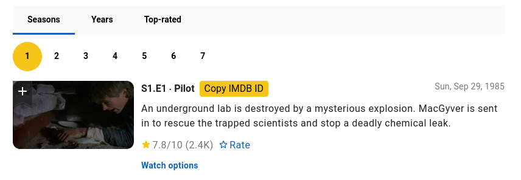

# IMDBTitleID

A simple Chrome and Firefox extension to copy the IMDB title ID from links on an IMDB page.

Ever need to quickly copy the IMDB ID from a movie or TV show link? This extension adds a "Copy IMDB ID" button next to each relevant link, making it easy to grab the ID without having to dig through the URL.
